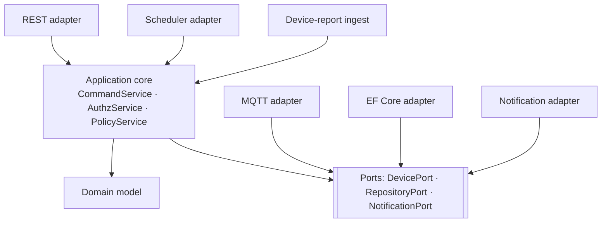
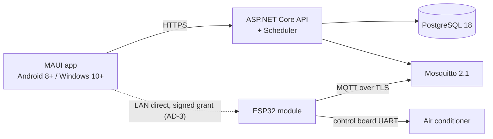
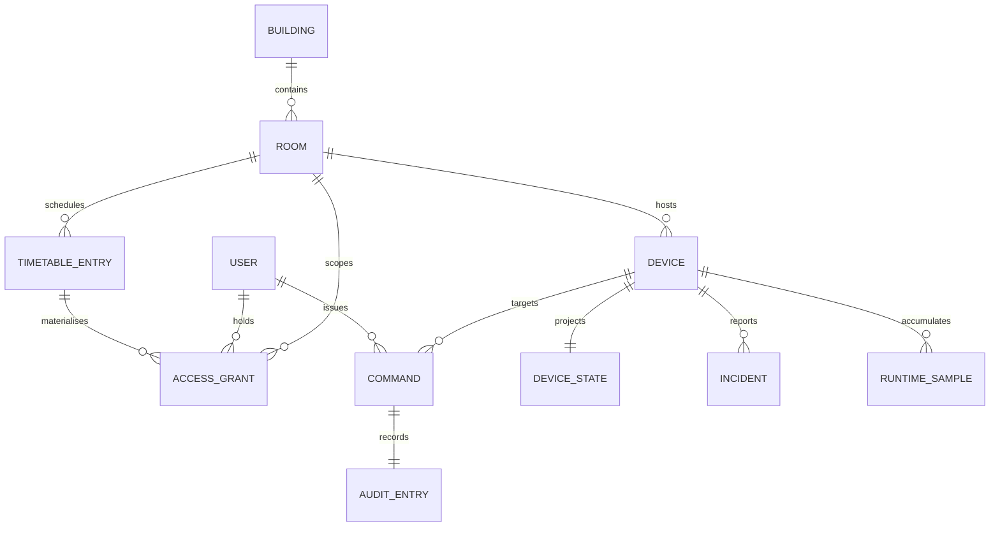

# Architecture Spine — Nhat Vuong Controller

## Design Paradigm

**Hexagonal (ports and adapters)** on the server. Three driving adapters raise commands — the REST API, the scheduler, and device-report ingest — and all three enter the same application core, which owns authorisation and policy. Driven adapters (MQTT, persistence, notification) sit behind ports the core defines.

The paradigm is chosen for one reason: a command to switch off a unit must be authorised and audited identically whether a lecturer tapped it, the scheduler decided the room was empty, or a device replayed it after an outage. Any layering that lets those three paths diverge fails NFR-05.

| Layer | Directory | May depend on |
| --- | --- | --- |
| Domain | `src/Domain/` | nothing (no framework references) |
| Application | `src/Application/` | Domain |
| Adapters | `src/Adapters/*/` | Application, Domain |



Dependencies point inward only. An adapter never calls another adapter.

## Invariants & Rules

### AD-1 — Single command pipeline

- **Binds:** CAP-4, CAP-5, CAP-6, CAP-9, CAP-10, CAP-11, CAP-20
- **Prevents:** three entry points each implementing their own authorisation and audit.
- **Rule:** No adapter invokes `DevicePort` directly. Every device-mutating action constructs a `Command` and submits it to `CommandService`, which authorises, audits, dispatches and records the outcome.

### AD-2 — Authorisation is a lookup, not a rule engine

- **Binds:** CAP-2, CAP-3, CAP-16
- **Prevents:** two divergent rights engines, and timetable semantics leaking into command handling.
- **Rule:** Timetable import and administrator temporary grants both write `AccessGrant` rows (`subject`, `room`, `validFrom`, `validTo`, `source`). Authorising a command is a point-in-time lookup against that table and nothing else.

### AD-3 — Offline authority is a server-signed grant, never a client claim

- **Binds:** CAP-20, CAP-2; subject to NFR-05
- **Prevents:** the LAN control path becoming an authorisation bypass.
- **Rule:** While online, the server issues a short-lived signed grant bound to subject, device and validity window, and pushes it to the device. A device accepts a LAN command only when presented with an unexpired, validly signed grant. Grant lifetime never exceeds the class window plus configured margin — which is also how CAP-2 revocation is implemented.

### AD-4 — The device owns its state; the server holds a projection

- **Binds:** CAP-7, CAP-8, CAP-21
- **Prevents:** the server overwriting reality from stale cache, and the app presenting cache as truth.
- **Rule:** Every stored state row carries `observedAt`. Consumers treat a projection older than the freshness bound as unknown, not as current. The server never issues a command whose only purpose is to reconcile its projection to the device.

### AD-5 — Offline actions replay as facts, never as commands

- **Binds:** CAP-20, CAP-21
- **Prevents:** double execution and resurrection of stale intent on reconnect.
- **Rule:** On reconnect a device sends an event log of what already happened, with timestamps and the grant each action ran under. The server appends to audit and updates the projection. It never converts a reported event into a new command.

### AD-6 — Cached device schedules are suppressed while the link is live

- **Binds:** CAP-9, CAP-10, CAP-11 against CAP-21
- **Prevents:** server scheduler and device firing the same shutdown, producing two commands and contradictory audit.
- **Rule:** A device executes its cached schedule only after loss of server connectivity exceeds the configured threshold. While connected, the server is the sole originator of scheduled actions.

### AD-7 — Audit is written by the pipeline, not by callers

- **Binds:** CAP-18 and every command-raising capability
- **Prevents:** rejected commands going unlogged, which CAP-2 and CAP-18 both explicitly require.
- **Rule:** `CommandService` writes the audit entry before dispatch and updates it with the result. Rejections are audited with the rejection reason. No adapter writes audit directly.

### AD-8 — UTC end to end; local time only at the edges

- **Binds:** CAP-2, CAP-9, CAP-10, CAP-11, CAP-16, CAP-19
- **Prevents:** class windows drifting between server, device and app.
- **Rule:** Store and transmit instants as UTC (ISO 8601). Convert to campus local time at exactly two places: the UI, and timetable import.

### AD-9 — Commands are idempotent and correlated

- **Binds:** CAP-6, CAP-8, CAP-20
- **Prevents:** retries double-applying, and per-unit results being unattributable.
- **Rule:** Every command carries a server-generated `commandId`. Devices keep a recent-id window and silently acknowledge duplicates without re-actuating. Every result references its `commandId`.

### AD-10 — The module must not impair manual operation `[ASSUMPTION]`

- **Binds:** all device capabilities
- **Prevents:** a firmware fault or dead module disabling a classroom.
- **Rule:** The module sits passive on the control-board bus. Loss of module power, firmware fault, or physical removal leaves the air conditioner fully operable from its own remote and panel.

### AD-11 — Room-wide actions fan out per unit

- **Binds:** CAP-6
- **Prevents:** partial success being unreportable.
- **Rule:** A room-wide action expands into one command per unit, each independently authorised, audited and reported. The aggregate result lists per-unit outcomes.

### AD-12 — Only the server evaluates policy

- **Binds:** CAP-2, CAP-5, CAP-9, CAP-10, CAP-13
- **Prevents:** firmware and client copies of margin, X, N, minimum setpoint and operating hours drifting apart.
- **Rule:** Policy thresholds live in server configuration. Devices and clients receive resulting absolute times and bounds, never the policy itself. No threshold is compiled into firmware or client code.

### AD-13 — Per-brand protocol adapters behind one port

- **Binds:** CAP-4, CAP-5, CAP-7
- **Prevents:** per-brand protocol detail leaking into command and state handling on the device.
- **Rule:** Firmware talks to a single internal `ClimateDevice` interface. Each air-conditioner brand is a separate adapter behind it, adopted from existing open-source implementations rather than written from scratch.

### AD-14 — Grants are Ed25519-signed; devices hold only a public key

- **Binds:** AD-3, CAP-20
- **Prevents:** a shared secret replicated across 300 modules becoming a forgery vector when one module is opened.
- **Rule:** Grant signatures are Ed25519, verified on device with libsodium. The device stores the server public key only. Symmetric HMAC is not used unless per-device secret storage under flash encryption is separately justified.

## Consistency Conventions

| Concern | Convention |
| --- | --- |
| Naming | Entities singular PascalCase (`Device`, `AccessGrant`); ports suffixed `Port`; adapters suffixed by transport (`MqttDeviceAdapter`). |
| Identifiers | `Guid` v7 for all server-generated ids, including `commandId`. Devices are additionally keyed by immutable hardware id from the QR code. |
| Dates and times | UTC, ISO 8601, `DateTimeOffset` in code and `timestamptz` in Postgres. Campus local zone is `Asia/Ho_Chi_Minh`, applied per AD-8. |
| Error shape | RFC 9457 `application/problem+json` on every non-2xx REST response. Device-originated failures carry the vendor error code verbatim plus a normalised category. |
| Message envelope | Every MQTT payload carries `commandId` or `eventId`, `deviceId`, `occurredAt` (UTC), and a schema `version` field. |
| Connection handling | MQTTnet 5 removed `ManagedClient`; reconnect and exponential backoff are implemented once in `MqttDeviceAdapter` and nowhere else. |
| State mutation | Device state changes only via AD-1 command dispatch or AD-5 device report. No other write path to `DeviceState`. |
| Logging | Structured; every log line on a command path carries `commandId`. |
| Configuration | Policy thresholds in server config per AD-12; secrets from environment, never in source or firmware images. |
| Authorisation | Server-side only, via `AuthzService`, on every command path including scheduler-originated ones. |

## Stack

Verified current 2026-09-11. The code owns this once it exists.

| Name | Version |
| --- | --- |
| .NET (LTS, to 2028-11-14) | 10 |
| ASP.NET Core (Minimal APIs) | 10 |
| .NET MAUI `[ASSUMPTION]` — see Deferred | 10 |
| Entity Framework Core + Npgsql | 10.0.0 |
| PostgreSQL | 18.6 |
| Eclipse Mosquitto | 2.1.2 |
| MQTTnet | 5.2.0.1603 |
| ESP-IDF `[ASSUMPTION]` — confirm 6.0 vs 6.1 is current stable | 6.0 |
| libsodium (Espressif component) | 1.0.21 |

Scheduling uses `BackgroundService` with `PeriodicTimer` — no Quartz.NET or Hangfire. `.NET 8` and `.NET 9` both reach end of support on 2026-11-10 and are not viable starting points.

## Structural Seed



Core entities. Attributes appear here only where they are not themselves invariants.



Deployment: a single campus-hosted server host runs the API, scheduler, broker and database. Client apps reach it over campus WiFi; modules reach the broker on the same network, which is what makes the AD-3 LAN path possible when the campus internet uplink is down. Environments are `dev` (simulator only), `staging` (simulator fleet at CAP-22 scale), and `prod` (one campus host).

```text
nhat-vuong/
  src/
    Domain/              # entities, policy rules; no framework references
    Application/         # CommandService, AuthzService, PolicyService, ports
    Adapters/
      Rest/              # Minimal API endpoints
      Scheduler/         # BackgroundService + PeriodicTimer
      Mqtt/              # MQTTnet 5 client, DevicePort implementation
      Persistence/       # EF Core + Npgsql
      Notification/
    Client/              # MAUI app; Vietnamese resource files
  firmware/
    module/              # ESP-IDF project, ClimateDevice port + per-brand adapters
  simulator/             # virtual device fleet for CAP-22 and CI
  tests/
```

## Capability → Architecture Map

| Capability | Lives in | Governed by |
| --- | --- | --- |
| CAP-1 sign-in | `Adapters/Rest`, `Application` | NFR-03, NFR-05 |
| CAP-2, CAP-3 rights | `Application/AuthzService` | AD-2, AD-3, AD-8, AD-12 |
| CAP-4, CAP-5 control | `Application/CommandService` → `Adapters/Mqtt` | AD-1, AD-9, AD-12, AD-13 |
| CAP-6 room-wide | `Application/CommandService` | AD-11, AD-9 |
| CAP-7 true state | `firmware/module`, `Adapters/Mqtt`, `Client` | AD-4, AD-13 |
| CAP-8 result + health | `Application/CommandService` | AD-9, AD-4 |
| CAP-9, CAP-10, CAP-11 scheduling | `Adapters/Scheduler` | AD-1, AD-6, AD-8, AD-12 |
| CAP-12, CAP-13, CAP-14 maintenance | `Application`, `Adapters/Notification` | AD-4, AD-12 |
| CAP-15 registration | `Adapters/Rest`, `Client` | conventions (identifiers) |
| CAP-16 timetable import | `Application`, `Adapters/Persistence` | AD-2, AD-8 |
| CAP-17 reference data | `Adapters/Rest`, `Adapters/Persistence` | conventions (naming) |
| CAP-18 audit | `Application/CommandService` | AD-7 |
| CAP-19 reporting | `Adapters/Persistence` (`RUNTIME_SAMPLE`) | AD-8 |
| CAP-20 LAN control | `Client`, `firmware/module` | AD-3, AD-14, AD-5, AD-9 |
| CAP-21 cached schedule | `firmware/module` | AD-6, AD-5, AD-12 |
| CAP-22 scale | `simulator`, whole system | NFR-01, NFR-02 |
| CAP-23 recovery | deployment host | Deferred — supervision strategy |

## Deferred

- **MAUI versus Avalonia for the client.** MAUI 10 is pinned as inherited, but its support ends 2027-05-11 — six months after MAUI 11 ships, and far short of .NET 10's 2028 LTS date. Avalonia covers the same Android and Windows targets with no equivalent cliff. Revisit if platform bugs start costing sprint time.
- **CAP-23 supervision mechanism.** Health-check-and-restart is a deployment concern (systemd, container restart policy, or a supervisor); it does not constrain how the units above are built.
- **Which brands ship first.** AD-13 fixes the shape; the per-brand order depends on what the university actually owns. Mitsubishi and Daikin have the most mature prior art; Gree has the least and should carry budgeted engineering time.
- **Notification transport** for CAP-12 — push, email or in-app — does not affect the command pipeline and can be chosen when the maintenance workflow is built.
- **Reporting store strategy** for CAP-19. `RUNTIME_SAMPLE` retention and whether monthly aggregates are materialised is a volume question, answerable only once real sampling rates are known.
- **Multi-campus tenancy.** Out of scope for this spine; revisit only if a second campus is ever in play.

## As-built decisions (2026-09-29)

Decisions taken while implementing the spine in `src/`. Each closes (or narrows) a finding from
[reviews/review-rubric-walker.md](reviews/review-rubric-walker.md). Where a decision departs from the Stack table
above, the departure is stated.

| Finding | Decision | Code |
| --- | --- | --- |
| F-1 identity | JWT bearer (HMAC-SHA256, 8 h); `sub` = internal user id, which is also `AccessGrant.subject` and the audit actor. Passwords BCrypt (work factor 11); unknown emails are verified against a dummy hash so timing does not leak accounts. Sign-in is rate-limited per IP. | `Rest/Security/AuthSetup.cs`, `Application/Identity/AuthService.cs` |
| F-2 LAN bearer grant | Grant (ES256-signed) embeds the client's public key; every LAN command is signed with the matching private key over `nvc-lan-v1|device|commandId|action|value|issuedAt`, with ±90 s skew and the AD-9 id window. The LAN hop is HTTPS; the app pins the module certificate to the SHA-256 thumbprint the module reports and the server relays. | `Contracts/Lan/LanProtocol.cs`, `simulator/VirtualDevice.cs` |
| F-3 device clock | The module's clock is synchronised from `serverTime` in every retained config message. Until it has synchronised once, it refuses LAN grants and cached schedules. A battery-backed RTC remains a hardware decision (open). | `VirtualDevice.DeviceClock` |
| F-4 provisioning | Embedded MQTTnet broker replaces Mosquitto so each module authenticates with its own BCrypt-hashed password from the registry; client id must equal the hardware id; per-device topic ACL. Credentials are issued once at QR registration and can be rotated. Modules pin the server's grant-signing public key from their config. | `Adapters/Mqtt/EmbeddedMqttBroker.cs`, `DeviceRegistryService` |
| F-5 roles, precedence | Room control is authorised only by `AccessGrant` lookup (AD-2), for every role including administrators. Administrative endpoints are authorised by role. Class monitors obtain rights only through temporary grants. Precedence: within a configurable window (default 120 s) a monitor's command that conflicts with a lecturer's recent command is rejected and the monitor notified; a lecturer command that overrides a monitor's recent one notifies the monitor. Commands are serialised per device. | `CommandService.EvaluateAsync` |
| F-6 re-import | A valid file atomically replaces all entries whose start falls in the campus-local days it covers; replaced entries' grants are revoked (`TimetableReplaced`) and their pending pre-cools cancelled. Revoked-before-expiry grant ids are pushed to modules. | `TimetableImportService` |
| F-7, F-8 transport | Topics `nvc/v1/devices/{hw}/{cmd,config,ack,state,event,status}`, QoS 1; config and status retained; offline status is the last will. Modules report state every 5 s and on change (US-09 bound 10 s); the ack carries the board state read after execution. | `Contracts/Mqtt/MqttContract.cs` |
| F-9 AD-6 race | The server presumes a device silent after 2 × freshness; policy validation requires the module's offline threshold to be larger. Scheduler actions a module reports having executed offline mark the server-side action handled. | `PolicySettings.Validate`, `DeviceReportService` |
| F-10 closing vs class | Operating hours are a hard limit: at closing every running unit is switched off and on-commands are rejected, regardless of grants. | `SchedulingService.RunClosingAsync` |
| F-11 freshness | `StateFreshnessSeconds` (default 30) in server policy; stale projections show Offline and "stale" in the app. | `DeviceState.GetConnectivity` |
| F-12 id window | Modules keep the last 256 command ids; persistence across reboot is a firmware requirement. | `VirtualDevice.Remember` |
| F-13 grant lifetime | LAN grants last at most `MaxLanGrantMinutes` (default 120), never beyond the underlying grant. | `OfflineGrantService` |
| F-16 restart | Health contract `/health/ready` = database + MQTT gateway/broker + scheduler heartbeat. Scheduled actions are database state; missed ones fire late within `ScheduleCatchUpMinutes` (15) and are skipped beyond it. Commands left `Pending` by a crash resolve to `Failed` at start-up. | `Server/Infrastructure/HealthChecks.cs`, `CommandService.ResolveInterruptedAsync` |
| F-17 runtime producer | Runtime sessions open and close on observed power transitions and replayed facts; the report clips them to the month. | `DeviceReportService`, `ReportingService` |
| F-18 notifications | In-app notifications are stored by the core; `INotificationPort` delivers externally (log, optional SMTP). Events: device error (maintenance), prolonged disconnect (maintenance), long run (maintenance + administrators), precedence (class monitor). | `NotificationService`, `Adapters/Notification` |
| F-19 scheduler | Exactly one scheduler per deployment (`Scheduler:Enabled`). | `Adapters/Scheduler` |
| F-20 incidents | One open incident per device, kind and code; repeats increment a counter without re-notifying. Resolution records who, when and the note. | `MaintenanceService` |
| F-21 NFR-07/08 | No user-facing literal in client or server code: `Resources/Strings/AppResources*.resx` (app) and `Resources/Messages*.resx` (server text). CI gates service-layer coverage at 60%. | `Client/Localization`, `.github/workflows/ci.yml` |
| F-25 versions | Every envelope carries `version`; receivers accept ≤ current and drop newer. REST is versioned by path (`/api/v1`). | `EnvelopeVersion` |
| F-26 key rotation | Replace the signing key file and restart; the new public key reaches modules with the next retained config. | `EcdsaGrantSigner` |

Departures from the Stack table: MQTTnet 5 embedded broker instead of Mosquitto (F-4); ECDSA P-256 instead of
Ed25519 for grants (available natively in .NET on Android and Windows and in ESP32 mbedTLS); SQLite for
development and tests alongside PostgreSQL.

Still open: backup RPO/RTO and audit/runtime retention (F-23), metrics beyond the NFR-01 latency endpoint
(F-24), firmware update strategy (F-25), RTC in the module BOM (F-3), which AC brands ship first (AD-13).
